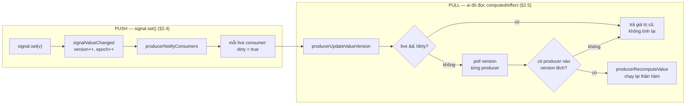
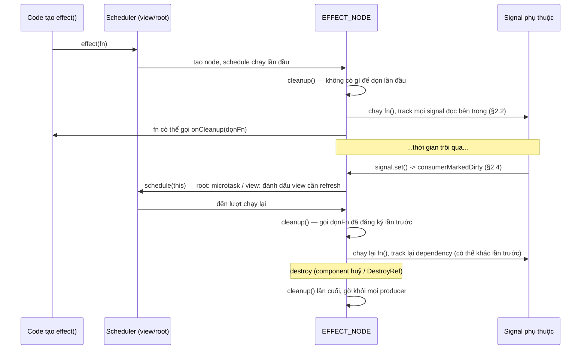

# Angular Signals — đọc từ source code, demo thật, và tư duy senior

> Toàn bộ phần "từ source code" dưới đây được trích từ repo `angular/angular` tại đúng tag
> **[`v22.1.1`](https://github.com/angular/angular/tree/v22.1.1)**
> (commit [`7c15737`](https://github.com/angular/angular/commit/7c15737f50c0f22b2f04e138f18ec862ac446d09))
> — khớp chính xác version `@angular/core` mà `package.json` của repo này ghim, không phải một
> snapshot `main` có thể trôi theo thời gian. Mỗi đoạn trích đều có permalink GitHub kèm số dòng
> trỏ thẳng vào commit đó — bấm vào để đối chiếu, không cần tin chay. Một vài đoạn được **rút gọn**
> (bỏ JSDoc, gộp bớt guard clause) để dễ đọc hơn cho mục đích giảng dạy; permalink luôn trỏ tới
> đoạn code thật đầy đủ, có ghi chú rõ khi bản rút gọn bỏ sót chi tiết đáng kể.
>
> Phần demo là app Todo thật nằm trong `src/app/` của repo này, build bằng `@angular/core@22.1.1`
> thật (không phải giả lập) — cách dựng nó (và một cái bẫy CLI-vs-framework-version khá thú vị)
> nằm ở cuối tài liệu.

**Mục lục**

1. [Bản đồ tổng quan](#1-bản-đồ-tổng-quan)
2. [Lớp lõi: đồ thị producer/consumer](#2-lớp-lõi-đồ-thị-producerconsumer-primitivessignalssrcgraphts)
3. [`signal()`](#3-signal-primitivessignalssrcsignalts)
4. [`computed()`](#4-computed-primitivessignalssrccomputedts)
5. [`effect()`](#5-effect--hai-lớp-watchts-primitive-và-render3reactivityeffectts-angular)
6. [`linkedSignal()`](#6-linkedsignal-primitivessignalssrclinked_signalts--render3reactivitylinked_signalts)
7. [`resource()`](#7-resource--ổn-định-publicapi-220-đúng-từ-bản-v22-này)
8. [Vì sao effect chạy được không cần Zone.js](#8-vì-sao-effect-có-thể-update-dom-mà-không-cần-zonejs)
9. [Demo: map primitive → file thật trong repo](#9-demo-map-primitive--file-thật-trong-repo)
10. [Checklist tư duy senior](#10-tổng-hợp--checklist-tư-duy-senior-khi-làm-việc-với-signals)
11. [Chạy demo](#11-chạy-demo)

Tài liệu liên quan: [ADR](./adr/README.md) · [Case studies](./case-studies/) ·
[So sánh state management](./comparison-state-management.md) · [Bài tập](../EXERCISES.md)

---

## 1. Bản đồ tổng quan

Signals của Angular được chia làm hai lớp rõ rệt:

1. **`packages/core/primitives/signals`** — một package con tách biệt, _không phụ thuộc gì vào
   Angular_ (không DI, không component, không template). Đây là đồ thị reactive thuần: `signal`,
   `computed`, `effect`-primitive (`watch`), `linkedSignal`. Nó được thiết kế để có thể tách ra
   dùng độc lập, và thực tế là nền tảng mà cả `@angular/core` lẫn (trong tương lai) các framework
   khác có thể dùng chung.
2. **`packages/core/src/render3/reactivity`** — lớp "khoác áo Angular" lên trên: đây là nơi
   `effect()` biết cách chạy trong `NgZone`/zoneless, biết tự huỷ theo `DestroyRef`, biết phân
   biệt "effect trong component" và "effect ở root"; nơi `resource()` tích hợp với `HttpClient`,
   SSR, `TransferState`; nơi `input()`/`model()` sinh ra signal từ property binding.

Tư duy đúng: lớp (1) là **cấu trúc dữ liệu + thuật toán lan truyền thay đổi**; lớp (2) là
**chính sách lịch trình chạy (scheduling policy)** đặt lên trên cấu trúc đó. Hiểu (1) trước sẽ
làm (2) trở nên hiển nhiên thay vì phải học thuộc.

---

## 2. Lớp lõi: đồ thị producer/consumer (`primitives/signals/src/graph.ts`)

### 2.1. Một node, hai vai trò

Mọi thứ trong hệ thống — `signal`, `computed`, `effect` — đều là một `ReactiveNode`:

```ts
// graph.ts
export interface ReactiveNode {
  version: Version; // tăng khi giá trị *thực sự* đổi
  lastCleanEpoch: Version; // epoch tại đó node này được xác nhận là "sạch"
  dirty: boolean; // (với vai trò consumer) có cần tính lại không
  producers: ReactiveLink | undefined; // những gì node này đọc
  consumers: ReactiveLink | undefined; // những gì "live" đang theo dõi node này
  producerMustRecompute(node: unknown): boolean;
  producerRecomputeValue(node: unknown): void;
  consumerMarkedDirty(node: unknown): void;
  consumerOnSignalRead(node: unknown): void;
}
```

📍 [`graph.ts#L120-L207`](https://github.com/angular/angular/blob/7c15737f50c0f22b2f04e138f18ec862ac446d09/packages/core/primitives/signals/src/graph.ts#L120-L207)
— bản rút gọn ở trên bỏ JSDoc và 4 field mới hơn (`recomputing`, `producersTail`,
`consumersTail`, `consumerAllowSignalWrites`, `debugName`, `kind`) không ảnh hưởng tới ý tưởng
cốt lõi "một node, hai vai trò" nhưng có thật trong source — xem permalink để biết đủ.

Một `computed` vừa là **consumer** (nó đọc các signal khác) vừa là **producer** (những thứ
khác đọc nó). Một `signal` gốc chỉ là producer. Một `effect` chỉ là consumer. Đây là lý do
`signal`/`computed`/`effect`/`linkedSignal` đều được cài bằng cách "kế thừa" (`Object.create`)
từ cùng một `REACTIVE_NODE` mẫu rồi ghi đè vài hàm — không có class hierarchy, chỉ có
prototype object với các hook khác nhau.

### 2.2. Đọc một signal = đăng ký dependency (`producerAccessed`)

```ts
// graph.ts
export function producerAccessed(node: ReactiveNode): void {
  if (activeConsumer === null) return; // đọc ngoài reactive context -> không track gì cả
  activeConsumer.consumerOnSignalRead(node);
  // ... tìm/khởi tạo link trong linked-list producers của activeConsumer
  if (isLive) {
    producerAddLiveConsumer(node, newLink); // chỉ tạo cạnh ngược nếu activeConsumer đang "sống"
  }
}
```

📍 [`graph.ts#L212-L295`](https://github.com/angular/angular/blob/7c15737f50c0f22b2f04e138f18ec862ac446d09/packages/core/primitives/signals/src/graph.ts#L212-L295)
— bản thật dài hơn nhiều: từ v22 nó còn dùng `producersTail`/`recomputing` để **incremental-diff**
danh sách producer khi một consumer chạy lại (thay vì rebuild toàn bộ linked list mỗi lần), cộng
một guard ném lỗi nếu đọc signal giữa lúc đang notify (`inNotificationPhase`). Ý tưởng cốt lõi ở
đây — "đọc = đăng ký, chỉ khi có `activeConsumer`" — không đổi; permalink để thấy tối ưu hoá thật.

`activeConsumer` là một biến module-level duy nhất (`let activeConsumer: ReactiveNode | null`).
Khi `computed`/`effect` chạy, nó gọi `consumerBeforeComputation` để đặt mình làm
`activeConsumer`, chạy hàm, rồi `consumerAfterComputation` để trả lại consumer trước đó. **Đây
chính là toàn bộ "phép màu" khiến `computed(() => a() + b())` tự biết phụ thuộc vào `a` và
`b`**: không có phân tích tĩnh, không có Proxy theo dõi property — chỉ là một biến toàn cục ghi
lại "ai đang đọc mình" tại đúng thời điểm hàm được gọi. Hệ quả trực tiếp (và là nguồn gốc mọi
lỗi "signal không update" phổ biến): **chỉ những signal được gọi _bên trong_ thân hàm mới được
track** — đọc trong `setTimeout`, trong `.then()`, hay gán ra biến rồi đọc sau, đều nằm ngoài
lượt track đó.

### 2.3. Live vs non-live consumer — vì sao `computed` không tự chạy

Danh sách `producers` (link list) luôn được xây khi một consumer _chạy_. Nhưng cạnh ngược
(`node.consumers`, dùng để _đẩy_ thông báo) chỉ được thêm nếu consumer đó đang "live"
(`consumerIsAlwaysLive || node.consumers !== undefined`). Một `effect` luôn `consumerIsAlwaysLive:
true` (xem `watch.ts`). Một `computed` **không** tự "live" — nó chỉ trở thành live _bắc cầu_
(transitively) khi có một live consumer nào đó (cuối cùng là một effect hoặc binding trong
template) đọc nó:

```ts
// graph.ts — producerAddLiveConsumer
function producerAddLiveConsumer(node: ReactiveNode, link: ReactiveLink): void {
  const wasLive = consumerIsLive(node);
  // ... chèn link vào node.consumers ...
  if (!wasLive) {
    // node vừa chuyển từ "không ai theo dõi" sang "có người theo dõi" ->
    // lan truyền: chính node này cũng phải trở thành live consumer của producer của nó
    for (let link = node.producers; link !== undefined; link = link.nextProducer) {
      producerAddLiveConsumer(link.producer, link);
    }
  }
}
```

📍 [`graph.ts#L523-L544`](https://github.com/angular/angular/blob/7c15737f50c0f22b2f04e138f18ec862ac446d09/packages/core/primitives/signals/src/graph.ts#L523-L544)
— cấu trúc linked-list thật dùng con trỏ `consumersTail` để chèn O(1) (doubly-linked), nhưng cùng
một thuật toán lan truyền "live" bắc cầu như đoạn rút gọn ở trên.

Nói cách khác: **một `computed()` không ai đọc thì hoàn toàn là code chết** — object được tạo
ra nhưng không nằm trong đường dẫn thông báo nào cả, và thân hàm của nó chỉ chạy khi _ai đó gọi
nó như một hàm_. Đây là khác biệt cốt lõi so với, ví dụ, MobX `computed` hay Vue `computed` mà
nhiều người mang theo trực giác sai khi mới học Angular Signals.

### 2.4. Ghi một signal = push "dirty", không push giá trị (`signalSetFn` → `producerNotifyConsumers`)

```ts
// signal.ts
export function signalSetFn<T>(node: SignalNode<T>, newValue: T) {
  if (!node.equal(node.value, newValue)) {
    // so sánh bằng `equal` (mặc định: Object.is)
    node.value = newValue;
    signalValueChanged(node);
  }
}

function signalValueChanged<T>(node: SignalNode<T>): void {
  node.version++;
  producerIncrementEpoch(); // epoch toàn cục +1
  producerNotifyConsumers(node); // *chỉ* đánh dấu dirty, không tính toán gì cả
}
```

📍 [`signal.ts#L86-L95`](https://github.com/angular/angular/blob/7c15737f50c0f22b2f04e138f18ec862ac446d09/packages/core/primitives/signals/src/signal.ts#L86-L95)
(`signalSetFn`) · [`signal.ts#L120-L125`](https://github.com/angular/angular/blob/7c15737f50c0f22b2f04e138f18ec862ac446d09/packages/core/primitives/signals/src/signal.ts#L120-L125)
(`signalValueChanged`) — khớp gần như nguyên văn, chỉ bớt một guard `producerUpdatesAllowed()`
ném lỗi nếu `.set()` bị gọi trong lúc không hợp lệ (ví dụ trong thân `computed`).

```ts
// graph.ts
export function producerNotifyConsumers(node: ReactiveNode): void {
  for (let link = node.consumers; link !== undefined; link = link.nextConsumer) {
    if (!link.consumer.dirty) consumerMarkDirty(link.consumer);
  }
}
```

📍 [`graph.ts#L339-L361`](https://github.com/angular/angular/blob/7c15737f50c0f22b2f04e138f18ec862ac446d09/packages/core/primitives/signals/src/graph.ts#L339-L361)

Đây là nửa **push** của mô hình. Việc set một signal chỉ lan truyền một cờ `dirty = true` xuôi
theo các live consumer — hoàn toàn không tính lại giá trị nào, không so sánh gì sâu hơn tham
chiếu/`equal` của chính node đó. `consumerMarkDirty` gọi tiếp `node.consumerMarkedDirty?.(node)`
— đây là hook để `effect` tự lên lịch chạy lại (microtask hoặc gắn vào chu kỳ CD), còn với
`computed` thì hook này là no-op: nó chỉ đơn giản nằm đó "bẩn" chờ ai đọc.

### 2.5. Đọc một computed = pull có nhớ (`producerUpdateValueVersion`)

```ts
// graph.ts
export function producerUpdateValueVersion(node: ReactiveNode): void {
  if (consumerIsLive(node) && !node.dirty) return; // live & sạch -> chắc chắn mới
  if (!node.dirty && node.lastCleanEpoch === epoch) return; // đã verify sạch ở epoch này rồi
  if (!node.producerMustRecompute(node) && !consumerPollProducersForChange(node)) {
    producerMarkClean(node); // producers không đổi version -> khỏi tính lại
    return;
  }
  node.producerRecomputeValue(node);
  producerMarkClean(node);
}
```

📍 [`graph.ts#L309-L334`](https://github.com/angular/angular/blob/7c15737f50c0f22b2f04e138f18ec862ac446d09/packages/core/primitives/signals/src/graph.ts#L309-L334)
— khớp gần như nguyên văn với source thật (chỉ bớt comment giải thích từng nhánh).

Đây là nửa **pull**. Ba tầng short-circuit theo đúng thứ tự chi phí tăng dần:

1. _Live & không dirty_ → producer chắc chắn đã "đẩy" dirty nếu có gì đổi, nên sạch nghĩa là
   sạch thật, khỏi kiểm tra gì thêm — đây là lý do effect + computed trong template rẻ ở steady
   state.
2. _Không dirty và đã verify sạch đúng epoch hiện tại_ (`lastCleanEpoch === epoch`) → vì epoch
   toàn cục chỉ tăng khi có `signal.set()` xảy ra, "sạch ở epoch X" nghĩa là chưa ai set gì kể
   từ lần cuối kiểm tra, nên vẫn sạch — tối ưu cho _non-live_ consumer bị đọc nhiều lần trong
   cùng một tick.
3. _Poll từng producer_ (`consumerPollProducersForChange`): so sánh `version` đã ghi nhận lần
   đọc trước với `version` hiện tại của producer — đệ quy xuống producer của producer nếu cần.
   Chỉ khi thật sự có version lệch mới gọi `producerRecomputeValue` (chạy lại thân hàm).

**Kết luận thực dụng:** `computed()` không "cache theo tham số" như `useMemo`— nó cache theo
_đồ thị phụ thuộc thực tế đã quan sát được ở lần chạy trước_, tự động cập nhật danh sách đó mỗi
lần chạy lại (`resetConsumerBeforeComputation`/`finalizeConsumerAfterComputation` dọn producer
cũ không còn được đọc tới — tức là **dependency là động**: `computed(() => flag() ? a() : b())`
sẽ ngừng track `b` hoàn toàn khi `flag()` là `true`, cho tới khi `flag()` đổi lại).

### 2.6. Sơ đồ tổng hợp: push (dirty) xuôi, pull (recompute) ngược

Hai nửa **push** (§2.4) và **pull** (§2.5) ghép lại thành một vòng hoàn chỉnh mỗi khi một signal
gốc bị `.set()`:



Điểm mấu chốt: **push chỉ lan cờ `dirty`, không lan giá trị** — recompute thật sự (`J`) chỉ xảy ra
ở nhánh pull, và chỉ khi có ai chủ động đọc. Một `computed` không ai đọc dừng lại ở bước `D`, không
bao giờ tới `E`.

---

## 3. `signal()` (`primitives/signals/src/signal.ts`)

```ts
export function createSignal<T>(initialValue: T, equal?: ValueEqualityFn<T>) {
  const node: SignalNode<T> = Object.create(SIGNAL_NODE);
  node.value = initialValue;
  const getter = () => signalGetFn(node); // producerAccessed(node) rồi return node.value
  const set = (v: T) => signalSetFn(node, v);
  const update = (fn) => signalSetFn(node, fn(node.value));
  return [getter, set, update];
}
```

📍 [`signal.ts#L53-L73`](https://github.com/angular/angular/blob/7c15737f50c0f22b2f04e138f18ec862ac446d09/packages/core/primitives/signals/src/signal.ts#L53-L73)
— bản rút gọn bỏ dòng debug (`getter.toString` cho dev-mode) và hook profiler
(`runPostProducerCreatedFn`), không đổi cơ chế cốt lõi.

`equal` mặc định là `Object.is` (`defaultEquals` trong `equality.ts`) — **so sánh tham chiếu**,
không deep-equal. Đây là lý do `TodoStore.toggleTodo()` trong demo luôn tạo mảng/object mới
(`todos.map(t => t.id === id ? { ...t, completed: !t.completed } : t)`) thay vì
`todo.completed = true` rồi `set(todos)` với cùng tham chiếu mảng cũ: nếu tham chiếu mảng ngoài
cùng không đổi, `signalSetFn` sẽ thấy `equal(old, new) === true` (cùng object) và **coi như
không có gì xảy ra** — không tăng version, không notify ai cả.

---

## 4. `computed()` (`primitives/signals/src/computed.ts`)

Ba giá trị sentinel đáng chú ý:

```ts
export const UNSET: any = Symbol('UNSET'); // chưa từng tính lần nào
export const COMPUTING: any = Symbol('COMPUTING'); // đang tính dở — dùng để bắt cycle
export const ERRORED: any = Symbol('ERRORED'); // lần tính trước ném lỗi
```

📍 [`computed.ts#L95-L113`](https://github.com/angular/angular/blob/7c15737f50c0f22b2f04e138f18ec862ac446d09/packages/core/primitives/signals/src/computed.ts#L95-L113)

```ts
producerRecomputeValue(node) {
  if (node.value === COMPUTING) throw new Error('Detected cycle in computations.');
  const oldValue = node.value;
  node.value = COMPUTING;                          // đặt cờ TRƯỚC khi chạy -> bắt được a() đọc a()
  const prevConsumer = consumerBeforeComputation(node);
  try {
    newValue = node.computation();
    setActiveConsumer(null);                       // gọi `equal` KHÔNG track read bên trong nó
    wasEqual = oldValue !== UNSET && node.equal(oldValue, newValue);
  } catch (err) {
    newValue = ERRORED; node.error = err;
  } finally {
    consumerAfterComputation(node, prevConsumer);
  }
  if (wasEqual) { node.value = oldValue; return; }  // *** không tăng version ***
  node.value = newValue;
  node.version++;
}
```

📍 [`computed.ts#L132-L172`](https://github.com/angular/angular/blob/7c15737f50c0f22b2f04e138f18ec862ac446d09/packages/core/primitives/signals/src/computed.ts#L132-L172)
— khớp gần như nguyên văn, chỉ bớt comment và một điều kiện phụ trong `wasEqual`
(`oldValue !== ERRORED && newValue !== ERRORED`, để tránh coi hai lỗi liên tiếp là "bằng nhau").

Hai điều mà nhiều lập trình viên bỏ sót:

- **Phát hiện vòng lặp là tự động và là lỗi cứng**, không phải giới hạn đệ quy: đọc chính mình
  giữa lúc đang tính sẽ thấy `COMPUTING` và ném lỗi ngay, không stack overflow âm thầm.
- **`computed` có "equality gate" ở tầng của chính nó**, độc lập với gate của từng signal nguồn:
  dù các signal đầu vào đổi (khiến thân hàm chạy lại), nếu giá trị trả về `equal` với giá trị cũ
  thì `version` _không_ tăng → **các consumer của computed này không hề biết có chuyện gì xảy
  ra**, dù bản thân computed _đã_ recompute. `TodoStore.stats` (`core/state/todo-store.ts`) không
  khai thác điều này (trả object mới mỗi lần, `equal` mặc định), nhưng docblock của
  `TodoStatsComponent` (`features/todo/todo-stats/todo-stats.ts`) giải thích rõ khi nào nên cân
  nhắc một `equal` tuỳ chỉnh để tận dụng đúng cơ chế này — xem thêm ở
  [checklist "Equality & mutation"](#10-tổng-hợp--checklist-tư-duy-senior-khi-làm-việc-với-signals)
  bên dưới.

---

## 5. `effect()` — hai lớp: `watch.ts` (primitive) và `render3/reactivity/effect.ts` (Angular)

### 5.1. Lớp primitive: luôn "live", chạy có kiểm soát tràn

```ts
// watch.ts
const WATCH_NODE = {
  ...REACTIVE_NODE,
  consumerIsAlwaysLive: true, // effect luôn được coi là "có người theo dõi"
  consumerMarkedDirty: (node) => node.schedule?.(node.ref), // dirty -> giao cho "scheduler" bên ngoài
};
```

📍 [`watch.ts#L143-L155`](https://github.com/angular/angular/blob/7c15737f50c0f22b2f04e138f18ec862ac446d09/packages/core/primitives/signals/src/watch.ts#L143-L155)

`Watch` không tự quyết định _khi nào_ chạy lại — nó chỉ gọi `schedule(this)` mỗi khi bị đánh dấu
dirty, và ai tạo ra nó (ở đây là `@angular/core`) quyết định `schedule` nghĩa là gì.

### 5.2. Lớp Angular: root effect vs. view effect

Đọc trực tiếp từ `effect.ts`:

```ts
export function effect(effectFn, options?) {
  const viewContext = injector.get(ViewContext, null, { optional: true });
  if (viewContext !== null) {
    // effect() gọi TỪ TRONG một component/directive constructor
    node = createViewEffect(viewContext.view, notifier, effectFn);
  } else {
    // effect() gọi từ service `providedIn: 'root'`, hoặc ngoài component tree
    node = createRootEffect(effectFn, injector.get(EffectScheduler), notifier);
  }
}
```

📍 [`effect.ts#L137-L197`](https://github.com/angular/angular/blob/7c15737f50c0f22b2f04e138f18ec862ac446d09/packages/core/src/render3/reactivity/effect.ts#L137-L197)
— bản rút gọn bỏ các assertion dev-mode (`assertNotInReactiveContext`, `assertInInjectionContext`)
và phần đăng ký `DestroyRef`/`InjectorProfiler`; nhánh `viewContext`/`createRootEffect` là nguyên
văn ý tưởng thật.

- **View effect**: gắn vào `LView` của component đang tạo ra nó
  (`view[EFFECTS].add(node)`), chạy như một phần chu kỳ change-detection của chính component đó
  (`consumerMarkedDirty` set cờ `HasChildViewsToRefresh` rồi `markAncestorsForTraversal`), và
  **tự huỷ khi component bị destroy** — không cần gọi `EffectRef.destroy()` thủ công.
  `TodoListComponent` trong demo dùng loại này (effect được tạo trong constructor).
- **Root effect**: không gắn với view nào, chạy như **microtask** độc lập, được dọn qua
  `DestroyRef` của injector đã tạo ra nó. Các `effect()` trong `TodoStore`
  (`providedIn: 'root'`) là loại này — chúng sống cùng vòng đời ứng dụng.

Cả hai đều dùng chung `EFFECT_NODE.run()`, và cả hai _đều_ chạy đúng một lần ngay khi được tạo
(`createRootEffect` gọi `node.notifier.notify(...)` ngay; `createViewEffect` gọi
`node.consumerMarkedDirty(node)` ngay) — **effect không phải "chỉ chạy khi có thay đổi"**, nó
luôn chạy một lần đầu để thiết lập baseline dependencies, y hệt `computed`. Bài học này không
phải lý thuyết suông —
[case study `completion-toast-race-condition`](./case-studies/completion-toast-race-condition.md)
kể lại một bug thật gặp phải khi build demo, xuất phát trực tiếp từ việc quên chi tiết này.

### 5.3. Cleanup (`onCleanup`)

```ts
// effect.ts
cleanup() {
  while (this.cleanupFns.length) this.cleanupFns.pop()!();
  this.cleanupFns = [];
}
```

📍 [`effect.ts#L235-L251`](https://github.com/angular/angular/blob/7c15737f50c0f22b2f04e138f18ec862ac446d09/packages/core/src/render3/reactivity/effect.ts#L235-L251)
— bản thật bọc thêm `setActiveConsumer(null)`/khôi phục lại, để việc gọi các hàm cleanup không bị
tính là "đọc signal trong effect này".

`cleanupFns` được gọi _trước mỗi lần effect chạy lại_, và khi effect bị destroy. Hàm cleanup do
chính effect đăng ký ở lần chạy trước (`onCleanup(fn)`) — nghĩa là mỗi lần chạy, effect "dọn dẹp
tàn dư của chính nó ở lần chạy trước" rồi mới làm việc mới. `TodoListComponent` dùng đúng pattern
này để huỷ `setTimeout` cũ của toast trước khi (có thể) đặt một cái mới.

### 5.4. Sơ đồ vòng đời một effect



Hai điểm hay bị bỏ sót khi chỉ đọc mô tả bằng lời: **chạy lần đầu không cần chờ signal nào đổi**
(mũi tên `Eff->>Dep` đầu tiên xảy ra ngay sau khi tạo, không phải sau `signal.set()`), và
**`cleanup()` luôn chạy trước fn**, kể cả ở lần chạy đầu tiên (chỉ là không có gì để dọn) — đây là
chi tiết mà
[case study `completion-toast-race-condition`](./case-studies/completion-toast-race-condition.md)
xây dựng trên đó.

---

## 6. `linkedSignal()` (`primitives/signals/src/linked_signal.ts` + `render3/reactivity/linked_signal.ts`)

Về bản chất, `linkedSignal` là một `computed` được "nâng cấp" để có thêm `.set()`/`.update()` ghi
đè trực tiếp giá trị hiện tại — nhưng lần tới khi `source` đổi, computation chạy lại và **ghi đè
lên mọi thứ người dùng đã `.set()` thủ công**. Chữ ký chính xác (từ
`render3/reactivity/linked_signal.ts`):

```ts
linkedSignal<S, D>(options: {
  source: () => S;
  computation: (source: S, previous?: { source: S; value: D }) => D;
  equal?: ValueEqualityFn<D>;
});
```

📍 [`render3/reactivity/linked_signal.ts#L47-L53`](https://github.com/angular/angular/blob/7c15737f50c0f22b2f04e138f18ec862ac446d09/packages/core/src/render3/reactivity/linked_signal.ts#L47-L53)
(chữ ký `@publicApi 20.0`, ổn định từ trước v22.1.1) · phần lưu state thật nằm ở
[`primitives/signals/src/linked_signal.ts#L32-L61`](https://github.com/angular/angular/blob/7c15737f50c0f22b2f04e138f18ec862ac446d09/packages/core/primitives/signals/src/linked_signal.ts#L32-L61)
(`LinkedSignalNode`) — bản rút gọn bỏ `debugName?` và `set?` (một callback tuỳ chỉnh hành vi ghi,
không dùng trong demo này).

`previous` cho computation biết cả `source` _và_ `value` của lần chạy trước — hữu ích khi bạn
muốn giữ một phần giá trị cũ thay vì luôn tính lại từ đầu. `TodoStore.draftTitle` trong demo
dùng đúng shape này: `source` là `editingId`, và `computation` chỉ reset khi `editingId` đổi
(chuyển sang sửa item khác), chứ không reset trên mỗi lần gõ phím — vì bản thân việc gõ phím đi
qua `.set()` (qua `updateDraft()`), không đi qua `computation`.

Đây là **ranh giới rõ ràng phân biệt ba loại state**, đáng nhớ:

| Primitive        | Ghi được? | Tự đồng bộ theo nguồn?                                                          |
| ---------------- | --------- | ------------------------------------------------------------------------------- |
| `signal()`       | Có        | Không — hoàn toàn độc lập                                                       |
| `computed()`     | Không     | Có — luôn suy ra lại từ nguồn                                                   |
| `linkedSignal()` | Có        | Có, nhưng chỉ khi `source` đổi — giữa hai lần đổi đó nó là `signal` bình thường |

---

## 7. `resource()` — ổn định (`@publicApi 22.0`) đúng từ bản v22 này

```ts
// resource/resource.ts, dòng 49
/**
 * @publicApi 22.0
 */
export function resource<T, R>(options: ResourceOptions<T, R> & {...}): ResourceRef<T>;
```

📍 [`resource/resource.ts#L45-L52`](https://github.com/angular/angular/blob/7c15737f50c0f22b2f04e138f18ec862ac446d09/packages/core/src/resource/resource.ts#L45-L52)
— dòng 49 khớp chính xác `@publicApi 22.0` như trích dẫn ở trên.

Trước v22, API này còn ở dạng developer-preview (và trước đó nữa từng có tên `rxResource` riêng
cho bản RxJS). Trong v22, chữ ký ổn định là:

```ts
resource({
  params?: (ctx) => R,                          // signal(s) quyết định KHI NÀO load lại
  loader: ({ params, abortSignal }) => Promise<T>,
  defaultValue?: T,
})
// -> { value, status, error, isLoading, hasValue(), reload() }
```

Có hai điều đáng chú ý mà chỉ đọc doc không thấy rõ bằng đọc `resource.ts`:

- `resource` **hủy** (`AbortController.abort()`) lần load đang chạy dở ngay khi `params` đổi lần
  nữa trước khi nó kịp resolve — loader nào bỏ qua `abortSignal` không sai về mặt state (kết quả
  cũ vẫn bị resource loại bỏ đúng), chỉ lãng phí round-trip mạng. `fetchInitialTodos()` trong
  demo minh hoạ việc tôn trọng `abortSignal` dù chỉ là `setTimeout` giả lập.
- `status` là một **state machine tường minh** (`idle | loading | reloading | resolved | local |
error`), không phải hai cờ boolean rời rạc (`loading`/`error`) dễ rơi vào trạng thái mâu thuẫn
  (`loading: true, error: true` cùng lúc) như pattern tự chế phổ biến trước khi có `resource()`.

---

## 8. Vì sao effect có thể update DOM mà không cần Zone.js

App demo **không có `zone.js`** trong `package.json` — không phải vì bị gỡ thủ công, mà vì từ
`ng new` (schematic hiện tại) nó vốn không được thêm nữa. Trong
`change_detection/scheduling/zoneless_scheduling_impl.ts`:

```ts
private readonly zoneIsDefined = typeof Zone !== 'undefined' && !!Zone.root.run;
```

📍 [`change_detection/scheduling/zoneless_scheduling_impl.ts#L67`](https://github.com/angular/angular/blob/7c15737f50c0f22b2f04e138f18ec862ac446d09/packages/core/src/change_detection/scheduling/zoneless_scheduling_impl.ts#L67)
— nguyên văn. Xem thêm [ADR 0001](./adr/0001-zoneless-signals-state.md) cho quyết định chọn
zoneless của chính repo này.

Không có `zone.js` global → `zoneIsDefined === false` → Angular tự dùng lịch trình dựa trên
signal (`producerNotifyConsumers` → hook `consumerMarkedDirty` của effect/template consumer →
`notifier.notify(...)` → `ApplicationRef` lên lịch một tick) thay vì dựa vào việc monkey-patch
`setTimeout`/`addEventListener` như NgZone. `provideZonelessChangeDetection()` (được gọi tường
minh trong `app.config.ts` của demo) không "bật" chế độ này — nó chỉ _xác nhận ý định_ và khiến
Angular cảnh báo ở dev-mode nếu `zone.js` lỡ bị load vào (ví dụ do một thư viện phụ thuộc kéo
theo). Nói cách khác: **với app mới hoàn toàn không có zone.js, signals + effects đã "vừa vặn"
với zoneless một cách tự nhiên**, vì cả hai đều xây trên cùng một cơ chế push-notify.

---

## 9. Demo: map primitive → file thật trong repo

| Primitive                      | File                                   | Vai trò trong app                                                                 |
| ------------------------------ | -------------------------------------- | --------------------------------------------------------------------------------- |
| `signal()`                     | `core/state/todo-store.ts`             | `_todos`, `_filter`, `_editingId`, `_completionEvents` — 4 nguồn sự thật duy nhất |
| `computed()`                   | `core/state/todo-store.ts`             | `filteredTodos`, `stats`, `allDone`                                               |
| `computed()`                   | `features/todo/todo-item/todo-item.ts` | `statusLabel` — computed cấp component                                            |
| `linkedSignal()`               | `core/state/todo-store.ts`             | `draftTitle` — ô sửa tên việc, reset đúng lúc chuyển item                         |
| `resource()`                   | `core/state/todo-store.ts`             | `seed` — giả lập tải danh sách việc ban đầu từ "server"                           |
| `effect()` (root)              | `core/state/todo-store.ts`             | Lưu `localStorage` mỗi khi `_todos` đổi; hydrate từ `seed` một lần                |
| `effect()` (view)              | `features/todo/todo-list/todo-list.ts` | Toast "✔ Đã hoàn tất" khi `completionEvents` phát tín hiệu                        |
| `untracked()`                  | `core/state/todo-store.ts`             | Đọc `_todos().length` trong effect hydrate mà không subscribe theo nó             |
| `input()` / `input.required()` | `todo-item.ts`, `todo-stats.ts`        | Props signal-based, thay `@Input()`                                               |
| `output()`                     | `todo-item.ts`, `todo-toolbar.ts`      | Thay `@Output() + EventEmitter`                                                   |
| `model()`                      | `todo-toolbar.ts`                      | `newTitle`, `activeFilter` — state cục bộ có thể bind hai chiều                   |

### 9.1. Vì sao `completionEvents` là một signal riêng, không phải "diff `stats().completed`"

Bản đầu tiên của toast trong `TodoListComponent` theo dõi `store.stats().completed` trong một
`effect()` và so sánh "tăng lên thì báo toast" — kiểm tra bằng Playwright thật lộ ra một bug: toast
hiện ra ngay khi tải trang, trước khi người dùng bấm gì cả, vì effect hydrate dữ liệu từ
`resource()` và effect đếm-toast là hai root/view effect độc lập chạy gần như đồng thời (mục 5.2).
Case study đầy đủ (triệu chứng → nguyên nhân → giải pháp đúng → bài học), kèm code fix thật, nằm ở
[`docs/case-studies/completion-toast-race-condition.md`](./case-studies/completion-toast-race-condition.md)
— đọc trước khi làm Bài 4 trong [`EXERCISES.md`](../EXERCISES.md).

---

## 10. Tổng hợp — checklist tư duy senior khi làm việc với Signals

**Kiến trúc state**

- Một `WritableSignal` **private**, expose ra ngoài qua `.asReadonly()`. Component không bao giờ
  gọi `.set()`/`.update()` trực tiếp lên state của store — mọi thay đổi đi qua method có tên
  nghiệp vụ rõ ràng (`toggleTodo`, không phải `todos.set(...)` rải rác khắp component).
- Mọi thứ suy ra được từ nguồn khác → `computed`, không phải một `signal` thứ hai đồng bộ thủ
  công bằng `effect`. Hai `signal` "phải luôn khớp nhau bằng tay" là dấu hiệu thiết kế sai.
- Cần state _ghi được_ nhưng phải _reset theo một nguồn khác_ → `linkedSignal`, không phải
  `signal` + `effect` để tự đồng bộ lại (effect ở đây dễ tạo vòng lặp/race, xem mục 9.1).

**Equality & mutation**

- So sánh mặc định là tham chiếu (`Object.is`), không sâu. Luôn tạo object/array mới khi "sửa" —
  không mutate rồi set lại cùng tham chiếu.
- `computed` trả về object literal mới mỗi lần recompute vẫn có thể coi là "không đổi" ở tầng
  _của chính nó_ nếu bạn cung cấp `equal` tuỳ chỉnh so sánh theo field — cân nhắc dùng khi
  computed đó nuôi một binding tốn kém (như một `OnPush` input xuống một component nặng).

**`effect()`**

- Chạy một lần ngay khi tạo, y hệt `computed` — đừng viết logic "chỉ nên chạy khi có thay đổi" mà
  thiếu guard cho lần chạy đầu.
- Dùng để đồng bộ ra _ngoài_ đồ thị signal (DOM ngoài binding, `localStorage`, log, phân tích) —
  không dùng để suy luận lại "chuyện gì vừa xảy ra" bằng cách diff state cũ/mới; hãy phát tín hiệu
  tường minh tại nơi hành động xảy ra nếu cần biết "đây là một sự kiện", như `completionEvents`.
- `untracked()` khi cần đọc giá trị hiện tại mà không muốn effect phụ thuộc vào nó — dùng đúng lúc
  sẽ tránh được vòng lặp vô hạn hoặc effect chạy lại thừa.
- Có `onCleanup`: mọi effect tạo ra resource ngoài (timer, subscription, listener) nên dọn bằng
  `onCleanup`, không dựa vào "component destroy thì trình duyệt tự dọn giùm".
- Effect trong constructor component = view effect, tự huỷ theo lifecycle của component đó; effect
  trong service `providedIn: 'root'` = root effect, sống cùng ứng dụng — chọn nơi tạo effect theo
  đúng vòng đời bạn cần, đừng tạo effect toàn cục cho state chỉ thuộc về một component.

**`resource()`**

- Ưu tiên `resource()` hơn tự quản lý `loading`/`error` bằng tay bằng vài `signal` boolean rời
  rạc — trạng thái kết hợp bất hợp lệ (loading và error cùng true) là có thật và dễ xảy ra với
  cách tự chế.
- Tôn trọng `abortSignal` trong loader nếu request có chi phí thật (network, tính toán nặng) — kể
  cả khi bạn nghĩ "request luôn nhanh nên không cần" (giả lập trong demo cũng làm điều này).

**Component API**

- `input()`/`output()` khi nguồn sự thật nằm ở nơi khác (store, component cha) — component chỉ
  phản ánh và phát sự kiện.
- `model()` khi chính component đó _sở hữu_ state và chỉ _tuỳ chọn_ cho phép cha bind hai chiều —
  đừng dùng nó chỉ để "tiết kiệm gõ" một cặp `input()+output()` khi thật ra bạn không muốn
  component sở hữu state đó (dễ tạo ra hai nguồn sự thật ngầm).
- `ChangeDetectionStrategy.OnPush` không còn bắt buộc để "ăn" hiệu năng của signals (zoneless +
  signal binding vốn đã hiệu quả bất kể strategy), nhưng vẫn nên khai báo tường minh: nó là tài
  liệu về ý định, và vẫn có ý nghĩa nếu app còn chỗ nào dùng `zone.js`/legacy binding.

**Kiểm chứng, không đoán**

- Đồ thị reactive im lặng khi sai — không có exception khi một effect chạy nhầm lúc, không có
  warning khi một computed không được ai đọc. Test hành vi runtime thật (unit test qua `TestBed` +
  ít nhất một lần chạy tay/E2E) rẻ hơn nhiều so với để bug kiểu "toast hiện sai lúc" lọt ra
  production. `todo-store.spec.ts` (8 test, xem mục 11) và pha kiểm tra bằng Chromium thật trong
  quá trình viết demo này là ví dụ cụ thể, không phải lời khuyên chung chung.

---

## 11. Chạy demo

```bash
npm install
npm start          # ng serve — http://localhost:4200
npm test           # ng test — vitest, 8 test trong todo-store.spec.ts + app.spec.ts
npm run build      # ng build — production bundle vào dist/angular-todo/browser
npm run typecheck  # tsc --noEmit, cả src/ lẫn e2e/
npx playwright install --with-deps chromium   # một lần
npm run build && npm run e2e                  # Playwright chạy trên chính bản build production
```

`.github/workflows/pipeline.yml` chạy đúng 5 bước này (lint → unit-test → build → e2e → deploy)
trên mỗi push/PR vào `main`, cộng thêm bước `deploy` lên GitHub Pages — chi tiết và cách bật/tắt
deploy nằm ở mục "CI/CD" trong `README.md`.

### Ghi chú kỹ thuật: vì sao `@angular/cli` không phải v22 dù framework là v22

`package.json` ghim `@angular/cli@^21.2.20` trong khi mọi package framework thật (`@angular/core`,
`common`, `compiler`, `platform-browser`, `compiler-cli`, `@angular/build`) đều ghim đúng
`22.1.1` — không phải nhầm lẫn, mà là một cái bẫy Node-version-vs-CLI-version khá thú vị. Lý do
đầy đủ (đọc từ `node_modules/@angular/cli/bin/ng.js` và
`@angular/build/src/utils/version.js`) nằm ở [ADR 0003](./adr/0003-cli-vs-core-version-pin.md).
